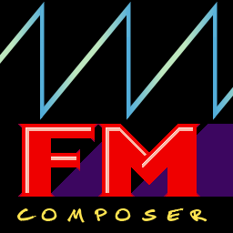

[Original Site (Archive.org)](https://web.archive.org/web/20180727172405/http://fmcomposer.org/en/)

FM Composer is a music and sound creation tool, featuring a custom FM synthesizer engine and a tracker-like interface.
Released with 150+ FM instruments and drums, ranging from synth to acoustic sounds, covering the whole MIDI instrument set.

# Features
- 6 operator, 24 voice polyphony FM sound engine with intuitive drag&drop interface
- Tracker-style sequencer
- Lots of effects available : vibrato, tremolo, arpeggio, pitch slides, real time FM parameter modification, loop points...
- MIDI integration : MIDI file import with partial XG/GS support, MIDI keyboard support
- MUS integration: DMX MUS file import
- Wave export
- Piano roll view

# Example songs
See what can be done with FM Composer :

https://youtu.be/bT__3KI3Lt4

https://youtu.be/N0PHPe-Iogg

https://youtu.be/QDqQRyy_xSA

# Why
Modern world lacks modern trackers. There is very few custom FM engines in the VST market, most of them are emulating old existing hardware.
This is a attempt to make a good yet minimalistic FM synthesizer, with a very graphical, easy to use interface.
This is also an attempt to provide real time sound synthesis for video games. Since the FM engine is a separate module with very few dependencies, it can be intergrated into other projects. Playback with real time modification of the song is possible for interactive content.

# Technical overview
GUI is written in C++ and using the SFML library to get low level access to the display, keyboard and mouse input. Each GUI element has its class. They are used by Views which are the actual program screens (Pattern screen, Instrument screen, Settings etc.). Views, for most of them, contain everything they need for providing the features to the user. This results in quite big classes, which are split in several files for readability.

The audio engine is written in pure C and was optimized for lowest CPU usage possible (cache-friendly structures, loops on small data sets, no function calls in critical parts, taking advantage of unsigned int wrapping for phase accumulators and so on). A part of the optimization relies on the use of FISTP instruction instead of the standard C ftol() for int/float conversions.

FM Composer uses its own binary format, FMCI for storing instruments and .FMCS for the songs.

# Compiling
For Unix builds, you'll need the following additional development libraries :
- SFML 2 (package names may vary; for Debian/Ubuntu this is likely `libsfml-dev`)
- ALSA (package names may vary; for Debian/Ubuntu this is likely `libasound2-dev`)

The program and necessary resources will be located in the `/bin` subdirectory of your build folder when compilation is complete.

On Unix, the program can also be installed via `cmake --install <build folder>` to an appropriate location. This usually requires root permissions.

# Thanks

- Masami Komuro (some FM sounds and the 'sandtracking' song used as demo in versions before 1.4)
- Klairzaki Fil-Xter (ideas & quality testing)
- Isaac Zuniga (ideas & quality testing)
- Laurent Gomila & contributors ([SFML lib](https://www.sfml-dev.org/))
- Guillaume Vareille ([tinyfiledialogs lib](https://sourceforge.net/projects/tinyfiledialogs/))
- Brodie Thiesfield ([SimpleIni lib](https://github.com/brofield/simpleini))
- Ross Bencina/Phil Burk/Roger B. Dannenberg ([PortMidi](http://portmedia.sourceforge.net/portmidi/)/[PortAudio lib](http://portaudio.com/))
- The Google team (Material Icons)
- Josua Rieder ([ProgramOptions](https://github.com/Fytch/ProgramOptions.hxx))
- Gregory Pakosz ([whereami](https://github.com/gpakosz/whereami))
- Id Software, Inc., Simon Howard, Ben Ryves ([SLADE3](https://github.com/sirjuddington/SLADE)) (MUS2MIDI conversion)
